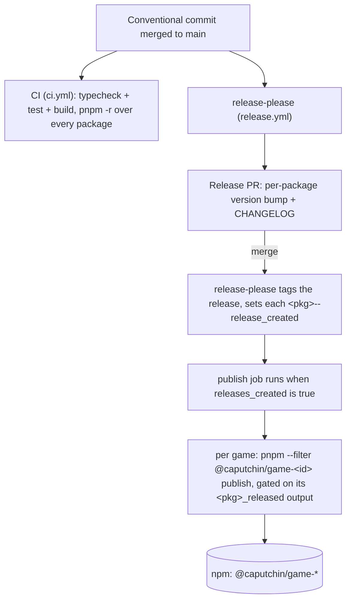

# Contributing

## Adding a new game

Two phases: build the package, then register it in the pipeline so it gets
versioned and published. Mirror an existing game (`packages/leaf-memory/` or
`packages/dino-runner/`) end to end; every file below has a working twin there.

**Build the package**

1. Create `packages/<game-id>/` mirroring the `packages/leaf-memory/` layout.
2. Set `name` in `packages/<game-id>/package.json` to the npm coordinate
   (`@caputchin/game-<game-id>`), version `0.1.0`, and `files` to what ships to
   npm (`dist`, `caputchin.json`, plus any notices).
3. Write `packages/<game-id>/caputchin.json` with the [marketplace manifest](https://github.com/Caputchin/caputchin-platform/blob/main/docs/features/marketplace.md) fields.
4. Implement the game against [`@caputchin/game-sdk`](https://www.npmjs.com/package/@caputchin/game-sdk).
5. Add the new package path to the collection [`caputchin.json`](caputchin.json) `games` array (the marketplace browses this).

**Register it in the pipeline** (see [Pipeline](#pipeline-ci-versioning-and-publishing) for what each does)

6. Add the package to [`release-please-config.json`](release-please-config.json) `packages` (a `component` + `package-name` entry).
7. Add its initial version to [`.release-please-manifest.json`](.release-please-manifest.json) (`"packages/<game-id>": "0.1.0"`).
8. Add a publish step + output to [`.github/workflows/release.yml`](.github/workflows/release.yml), mirroring the `@caputchin/game-dino-runner` block (see [Publishing](#3-publishing-releaseyml)).
9. Regenerate the lockfile and commit it: `pnpm install --lockfile-only`, then commit `pnpm-lock.yaml`. CI installs with `--frozen-lockfile`, so a new package's dependencies must already be in the committed lockfile or CI fails with `ERR_PNPM_OUTDATED_LOCKFILE`.

10. Run `pnpm verify`. All three stages (typecheck, test, build) must pass.

## Game design constraints (non-negotiable)

- **Bundle is single-file**, IIFE format. No code splitting, no dynamic `import()`, no `Worker(url)`, no external `fetch`. All assets inline as data URLs. See [game-distribution](https://github.com/Caputchin/caputchin-platform/blob/main/docs/features/game-distribution.md#bundle-constraint).
- **`bridge.pass` is success-only.** Call it when the user passes the round. If the user fails or abandons, do not call it; silence is the failure signal. See [ADR-0030](https://github.com/Caputchin/caputchin-platform/blob/main/docs/adr/0030-bridge-pass-not-complete.md).
- **Score is your own scale.** Any number. The platform records it verbatim. Scores compare within a single game; cross-game comparison is not a goal. See [game-sdk docs](https://github.com/Caputchin/caputchin-sdk/blob/main/packages/game-sdk/README.md).
- **Responsive, touch, accessible by default.** First-party games set the bar: `support.responsive`, `support.touch`, `support.accessible` should all be `true`.
- **Honor `prefers-reduced-motion`.** Skip non-essential animations when set.
- **No external font / CDN fetches.** CSP blocks them. Use the system font stack.

## Repo layout

```
caputchin-games/
  caputchin.json              # collection manifest (the Core Pack wrapper)
  packages/
    leaf-memory/
      caputchin.json          # game manifest (@caputchin/game-leaf-memory)
      preview.png             # marketplace thumbnail (600x315)
      src/                    # game source
      tests/                  # unit tests
      dist/                   # built bundle (single self-contained IIFE)
```

## Commits

Conventional Commits, single-line subject only. See the project root [CLAUDE.md](https://github.com/Caputchin/caputchin-platform/blob/main/CLAUDE.md) for the full rule.

## Verification

Run from the repo root, before pushing:

```bash
pnpm verify
```

All three stages must be green before opening a PR.

## Pipeline: CI, versioning, and publishing

Each package is its own npm release line. A commit to `main` fans out to two
GitHub Actions workflows: [`ci.yml`](.github/workflows/ci.yml) verifies, and
[`release.yml`](.github/workflows/release.yml) drives [release-please](https://github.com/googleapis/release-please)
and the npm publish.



### 1. CI verify (`ci.yml`)

Runs on every push and PR to `main`: a single `verify` job that runs
`pnpm -r typecheck`, `pnpm -r --if-present test`, and `pnpm -r build`. Because
every step is recursive (`-r`) over the whole workspace, **a new game package is
picked up automatically**; there is nothing to register here. Just make sure
`pnpm verify` is green locally first.

### 2. Versioning (release-please)

The `release-please` job reads [`release-please-config.json`](release-please-config.json)
(which packages exist, their npm names) and [`.release-please-manifest.json`](.release-please-manifest.json)
(each package's current version). It accumulates Conventional Commits per
package and keeps an open **Release PR** that bumps versions and writes the
CHANGELOG; merging that PR tags the release and emits a
`packages/<game-id>--release_created` output.

A new game must appear in **both** files (step 6–7 above): a `component` +
`package-name` entry in the config, and a `"packages/<game-id>": "0.1.0"` line in
the manifest. Versions are release-please-managed, so never hand-edit a `version`,
`CHANGELOG`, or manifest version yourself; the only manual manifest edit is the
one-time initial-version line when you add the package.

### 3. Publishing (`release.yml`)

The `publish` job runs after `release-please` when any release was created. It
installs with a frozen lockfile, builds, then runs **one publish step per game**,
each gated on that game's release output so only the package that was actually
released gets pushed to npm.

Adding a game means two edits in [`release.yml`](.github/workflows/release.yml),
both mirroring the `@caputchin/game-dino-runner` block:

- a `<game>_released` line in the `release-please` job's `outputs` (reading
  `steps.release.outputs['packages/<game-id>--release_created']`);
- a `Publish @caputchin/game-<id>` step in the `publish` job, `if`-gated on that
  output, running `pnpm --filter @caputchin/game-<id> publish --access public --no-git-checks`.

Repo-level secrets (`NPM_TOKEN` for the registry, `RELEASE_APP_ID` /
`RELEASE_APP_PRIVATE_KEY` for the release app) are already configured, so there
is no per-game change.

A game that skips step 8 still gets versioned (a Release PR, a tag) but is
**never published to npm**: the symptom is a tagged release with no package on
the registry.
